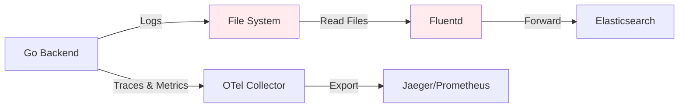
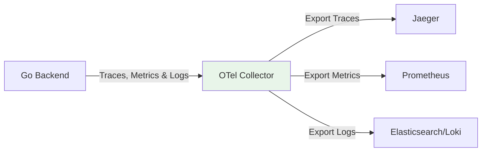
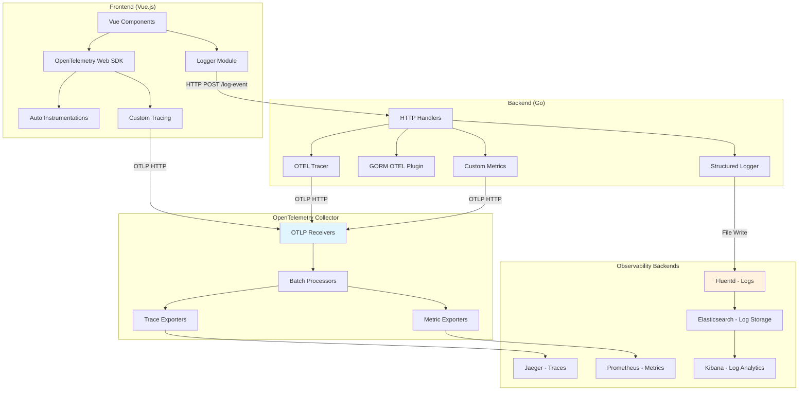
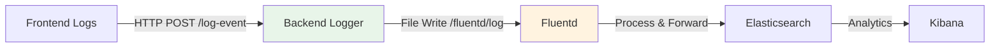

# OpenTelemetry Web Application

A comprehensive web application demonstrating modern observability practices with a Vue.js frontend, Go backend, PostgreSQL database, and complete observability pipeline using OpenTelemetry, Prometheus, Grafana, Jaeger, Fluentd, Elasticsearch, and Kibana. All components are containerized with Docker and orchestrated using Kubernetes, with simplified deployment through two separate HELM charts.

## Table of Contents

- [Project Overview](#project-overview)
- [OpenTelemetry Benefits & Limitations](#opentelemetry-benefits--limitations)
- [OpenTelemetry Usage & Architecture](#opentelemetry-usage--architecture)
- [Milestone 1: Docker](#milestone-1-docker)
- [Milestone 2: Kubernetes](#milestone-2-kubernetes)
- [Milestone 3: HELM](#milestone-3-helm)
- [What Flows Through OpenTelemetry Collector](#what-flows-through-opentelemetry-collector)
- [What Does NOT Flow Through OpenTelemetry Collector](#what-does-not-flow-through-opentelemetry-collector)
- [Getting Started](#getting-started)
- [Contributing](#contributing)

## Project Overview

This project showcases a production-ready observability stack featuring:

- **Frontend**: Vue.js SPA with OpenTelemetry web instrumentation
- **Backend**: Go REST API with comprehensive telemetry (traces, metrics, logs)
- **Database**: PostgreSQL with GORM OpenTelemetry instrumentation
- **Observability Stack**:
  - OpenTelemetry Collector for traces and metrics collection
  - Prometheus for metrics storage and alerting
  - Grafana for visualization and dashboards
  - Jaeger for distributed tracing
  - EFK Stack (Elasticsearch, Fluentd, Kibana) for log management
  - cAdvisor for container metrics

---

## OpenTelemetry Benefits & Limitations

### 🚀 Benefits

#### 1. Vendor-Agnostic Instrumentation
OpenTelemetry provides a **standard interface** to instrument your code for metrics, traces, and logs. You can instrument once and export to any observability backend such as:

- **Jaeger** (Distributed Tracing)
- **Prometheus** (Metrics)
- **Loki** (Logs)
- **Zipkin** (Tracing)
- **New Relic** (APM)
- **Datadog** (Full-stack observability)
- **Elasticsearch** (Logs & Analytics)

**Time & Effort Savings:**
- ✅ No need to rewrite instrumentation code when switching backends
- ✅ Config changes (not code changes) are sufficient to change where data goes
- ✅ Future-proof your observability investment

**Example from our project:**
```yaml
# Switch from Jaeger to Zipkin - just config change
exporters:
  # jaeger:
  #   endpoint: jaeger:14250
  zipkin:
    endpoint: http://zipkin:9411/api/v2/spans
```

#### 2. End-to-End Distributed Tracing
OpenTelemetry enables **full visibility** into how a request flows through the system:

```
Frontend (Vue.js) → Backend (Go API) → Database (PostgreSQL) → External APIs
```

**How it works:**
1. **Context Injection**: Client injects trace context into HTTP headers (`traceparent`, `tracestate`)
2. **Context Extraction**: Server extracts context from headers and continues the trace
3. **Span Linking**: All operations under a single trace ID for complete request flow

**Business Value:**
- 🔍 Track performance bottlenecks across services
- 📊 Understand system behavior and dependencies  
- 🐛 Improve debugging with correlated spans
- 📈 Monitor SLA compliance end-to-end

**Implementation in our project:**
```javascript
// Frontend: Context propagation
const headers = {}
propagation.inject(ctx, headers)
await fetch('/api/stocks', { headers })
```

```go
// Backend: Context extraction
ctx := otel.GetTextMapPropagator().Extract(r.Context(), 
    propagation.HeaderCarrier(r.Header))
ctx, span := tracer.Start(ctx, "fetch_stocks")
```

#### 3. Correlation Between Telemetry Signals
OpenTelemetry enables **correlation** between traces, metrics, and logs through shared context:

- **Trace Context in Logs**: Every log entry includes `trace_id` and `span_id`
- **Metrics with Trace Attribution**: Link performance metrics to specific traces
- **Cross-Signal Analysis**: Debug issues by jumping between traces, logs, and metrics

**Example correlation:**
```json
{
  "level": "ERROR",
  "msg": "Database query failed",
  "trace_id": "4bf92f3577b34da6a3ce929d0e0e4736",
  "span_id": "00f067aa0ba902b7",
  "error": "connection timeout"
}
```

### ⚠️ Current Limitations & Future Improvements

#### 1. **Server-Side Logging Pipeline Disconnect**

**Current Issue:**


The current implementation **does not support OpenTelemetry-based logging** on the server side. Instead, logs are collected through a **separate Fluentd pipeline** that reads log files from the Go backend and forwards them to Elasticsearch.

**Problems:**
- ❌ Disconnected logging pipeline not integrated with OTel traces/metrics
- ❌ Additional infrastructure complexity (Fluentd, file volumes)
- ❌ Potential log loss if file system issues occur
- ❌ No unified configuration for all telemetry signals

**Future Solution:**


**Implementation Plan:**
```go
// Future: OpenTelemetry Logs SDK
import "go.opentelemetry.io/otel/log"

loggerProvider := log.NewLoggerProvider(
    log.WithResource(resource.Default()),
    log.WithLogRecordProcessor(
        log.NewBatchLogRecordProcessor(otlploghttp.New()),
    ),
)

// Structured logs with embedded trace context
logger := loggerProvider.Logger("stock-tracker-service")
logger.EmitLogRecord(ctx, log.LogRecord{
    Timestamp: time.Now(),
    Body:      log.StringValue("Database query executed"),
    Attributes: []log.KeyValue{
        log.String("query.table", "users"),
        log.Int64("query.duration_ms", 150),
    },
})
```

#### 2. **Limited Frontend Observability**

**Current State:**
- ✅ **Traces**: User interactions, API calls, navigation
- ❌ **Metrics**: No frontend performance metrics
- ❌ **Logs**: No client-side error logging through OTel

**Missing Capabilities:**
- Frontend performance metrics (page load times, bundle sizes)
- Client-side error tracking and logging
- User experience metrics (Core Web Vitals)
- Real User Monitoring (RUM) data

**Future Improvements:**
```javascript
// Frontend Metrics (Planned)
import { metrics } from '@opentelemetry/api'

const meter = metrics.getMeter('stock-tracker-frontend')
const pageLoadTime = meter.createHistogram('page_load_duration_ms')
const userInteractions = meter.createCounter('user_interactions_total')

// Frontend Logging (Planned)  
import { logs } from '@opentelemetry/api'

const logger = logs.getLogger('stock-tracker-frontend')
logger.emit({
  severityText: 'ERROR',
  body: 'API call failed',
  attributes: {
    'error.type': 'NetworkError',
    'api.endpoint': '/stocks/AAPL'
  }
})
```

#### 3. **Benefits of Full OpenTelemetry Integration**

Once limitations are addressed:

**Unified Pipeline:**
- 🎯 Single configuration for all telemetry data
- 🔧 Simplified infrastructure (no Fluentd needed)
- 📊 Better correlation between all signals
- 🚀 Consistent sampling and filtering policies

**Complete End-to-End Visibility:**
- 👤 Frontend user experience metrics
- 🌐 Network performance tracking  
- 🔗 Full request trace from browser to database
- 📱 Client-side error correlation with backend traces

**Implementation Roadmap:**
1. **Phase 1**: Implement OTel Logs SDK in backend
2. **Phase 2**: Add frontend metrics collection
3. **Phase 3**: Implement client-side logging
4. **Phase 4**: Remove Fluentd dependency
5. **Phase 5**: Unified observability dashboard

---

## OpenTelemetry Usage & Architecture

### Frontend OpenTelemetry Implementation



### Detailed OpenTelemetry Components

#### 1. Frontend Instrumentation (`frontend/src/tracing.js`)
```javascript
// Web Tracer Provider with custom service name
const provider = new WebTracerProvider({
  resource: Resource.default().merge(new Resource({
    'service.name': 'stock-tracker-frontend',
  })),
});

// OTLP HTTP Exporter to OTel Collector
const exporter = new OTLPTraceExporter({
  url: "http://otel-collector.127.0.0.1.sslip.io/v1/traces"
});

// Auto-instrumentations for DOM, Fetch, etc.
registerInstrumentations({
  instrumentations: [getWebAutoInstrumentations()],
});
```

#### 2. Backend Instrumentation (`backend/opentel.go`)
```go
// Trace Provider with OTLP HTTP exporter
traceExporter, err := otlptracehttp.New(ctx,
    otlptracehttp.WithEndpoint("otel-collector-service:4318"),
    otlptracehttp.WithInsecure(),
    otlptracehttp.WithURLPath("/v1/traces"),
)

// Custom metrics for business logic
var (
    httpRequestCount        metric.Int64Counter
    externalAPICallDuration metric.Float64Histogram
    dbQueryDuration         metric.Float64Histogram
    loginAttempts           metric.Int64Counter
)
```

#### 3. Database Instrumentation (`backend/database.go`)
```go
// GORM with OpenTelemetry plugin
if err := DB.Use(otelgorm.NewPlugin(
    otelgorm.WithDBName("stock-tracker-db"),
    otelgorm.WithAttributes(
        attribute.String("db.system", "postgresql"),
        attribute.String("service.name", "stock-tracker"),
    ),
)); err != nil {
    return fmt.Errorf("error enabling OpenTelemetry for GORM: %w", err)
}
```
---

## Milestone 1: Docker

**Objective**: Containerize all application components and observability tools for consistent development and testing environments.

### Key Components

#### 1. Application Containers
- **Frontend Container** (`frontend/Dockerfile`):
  ```dockerfile
  # Multi-stage build with Node.js and Nginx
  FROM node:20-slim AS builder
  # OpenTelemetry dependencies in package.json
  FROM nginx:1.25-alpine AS production
  ```

- **Backend Container** (`backend/Dockerfile`):
  ```dockerfile
  # Multi-stage Go build with SSL certificates
  FROM golang:1.24-alpine AS builder
  FROM alpine:3.20
  # Volume mount for log sharing with Fluentd
  ```

#### 2. Observability Stack (`docker/docker-compose.yml`)
- **OpenTelemetry Collector**: 
  - OTLP receivers on ports 4317 (gRPC) and 4318 (HTTP)
  - Host metrics collection
  - Exports to Jaeger and Prometheus

- **Complete EFK Stack**: 
  - Custom Fluentd with Elasticsearch plugin
  - Elasticsearch for log storage
  - Kibana for log analytics

#### 3. Configuration Files
- **OTel Collector Config** (`docker/otel-collector-config.yaml`):
  ```yaml
  receivers:
    otlp:
      protocols:
        grpc:
          endpoint: "0.0.0.0:4317"
        http:
          endpoint: "0.0.0.0:4318"
          cors:
            allowed_origins: ["http://localhost:6600"]
  ```

### Deliverables
- ✅ Multi-stage Dockerfiles for all components
- ✅ Docker Compose with 10+ services
- ✅ OpenTelemetry Collector configuration
- ✅ Custom Fluentd with Elasticsearch plugin
- ✅ Volume management for logs and data persistence

### Quick Start
```bash
cd docker
docker-compose up -d
```

**Access Points**:
- Frontend: http://localhost:6600
- Backend API: http://localhost:8000
- Grafana: http://localhost:3000 (admin/admin)
- Jaeger UI: http://localhost:16686
- Prometheus: http://localhost:9090
- Kibana: http://localhost:5601

---

## Milestone 2: Kubernetes

**Objective**: Deploy the entire stack to Kubernetes for production-ready, scalable orchestration.

### Key Components

#### 1. Application Deployments
- **Kubernetes Manifests** (`kubernetes/` directory):
  - Backend/Frontend deployments with resource limits
  - ConfigMaps for OTel Collector and application configs
  - Services for internal/external communication
  - Secrets for database credentials and certificates

#### 2. Observability Infrastructure
- **Elasticsearch Cluster**:
  - StatefulSet with persistent volumes
  - TLS/SSL with custom certificates
  - Service account token authentication

- **Kibana Dashboard** (`kubernetes/kibana.yaml`):
  ```yaml
  env:
    - name: ELASTICSEARCH_SERVICEACCOUNTTOKEN
      value: AAEAAWVsYXN0aWMva2liYW5hL2tpYmFuYS10b2tlbjpQdFVrMGM2LVRRMmxteml4SjlfY2p3
    - name: ELASTICSEARCH_SSL_VERIFICATIONMODE
      value: none
  ```

- **cAdvisor Monitoring** (`kubernetes/cadvisor.yaml`):
  - DaemonSet for node-level container metrics
  - Host volume mounts for system access

### Deliverables
- ✅ Complete Kubernetes manifests
- ✅ Persistent storage configurations
- ✅ SSL/TLS certificate management
- ✅ Service account and RBAC setup
- ✅ Resource quotas and health checks

### Deployment Commands
```bash
# Create secrets
kubectl create secret generic elasticsearch-master-credentials \
  --from-literal=username=abdullah \
  --from-literal=password=edhi12

kubectl create secret generic es-ca-cert \
  --from-file=http_ca.crt=./cert.crt

# Deploy services
kubectl apply -f kubernetes/
```

---

## Milestone 3: HELM

**Objective**: Simplify deployments through two separate, specialized HELM charts for different concerns.

### Chart Architecture

#### 1. Applications Chart (`applications/Chart.yaml`)
**Purpose**: Observability and monitoring tools
```yaml
dependencies:
  - name: prometheus
    version: 27.23.0 
    repository: https://prometheus-community.github.io/helm-charts
  - name: jaeger
    version: 3.4.1 
    repository: https://jaegertracing.github.io/helm-charts
  - name: grafana
    version: 12.0.8
    repository: https://charts.bitnami.com/bitnami
  - name: cadvisor
    version: 0.1.10
    repository: https://charts.bitnami.com/bitnami
  - name: node-exporter
    version: 4.5.16   
    repository: https://charts.bitnami.com/bitnami
```

#### 2. Infrastructure Chart (`infra/Chart.yaml`)
**Purpose**: Core infrastructure and data services
```yaml
dependencies:
  - name: postgresql
    version: 12.8.5
    repository: https://charts.bitnami.com/bitnami
  # - name: elasticsearch
  #   version: 22.0.10
  #   repository: https://charts.bitnami.com/bitnami
```

### Separation of Concerns

| Chart | Responsibility | Components |
|-------|---------------|------------|
| **applications** | Observability Stack | Prometheus, Grafana, Jaeger, cAdvisor, Node Exporter, Frontend,Backend |
| **infra** | Data & Core Services | PostgreSQL, Elasticsearch, Fluentd, Otel-collector |

### Deployment Strategy

#### 1. Infrastructure First
```bash
cd infra
helm dependency update
helm install infra-stack .
```

#### 2. Applications Second
```bash
cd applications  
helm dependency update
helm install apps-stack .
```

### Benefits of Two-Chart Approach
- **Independent Scaling**: Scale observability separately from core services
- **Release Management**: Update monitoring tools without affecting data services
- **Environment Flexibility**: Different chart combinations for dev/staging/prod
- **Team Ownership**: Different teams can manage different charts

### Deliverables
- ✅ Two specialized HELM charts with clear separation
- ✅ Dependency management through official repositories
- ✅ Chart lock files for version consistency
- ✅ Modular deployment approach

---

## What Flows Through OpenTelemetry Collector

### 1. Frontend Telemetry
- **Traces Only**: 
  - User interaction spans (navigation, form validation)
  - HTTP request traces to backend
  - Custom business logic spans
- **Route**: Frontend → OTel Collector (HTTP :4318) → Jaeger
- **Implementation**: OTLP HTTP exporter with CORS support

### 2. Backend Telemetry
- **Traces**: 
  - HTTP handler spans
  - Database operation spans (via GORM plugin)
  - External API call spans (Alpha Vantage)
- **Metrics**:
  - HTTP request counters and duration histograms
  - Database query metrics
  - Business metrics (login attempts, API calls)
- **Route**: Backend → OTel Collector (HTTP :4318) → Jaeger/Prometheus

### 3. System Metrics
- **Host Metrics**: CPU, memory, disk, network from OTel Collector
- **Container Metrics**: Docker container stats via cAdvisor
- **Route**: OTel Collector hostmetrics → Prometheus

### OpenTelemetry Collector Configuration
```yaml
receivers:
  otlp:  # Frontend/Backend traces & metrics
    protocols:
      http:
        cors:
          allowed_origins: ["http://localhost:6600"]
  hostmetrics:  # System metrics

exporters:
  otlp: jaeger:4317     # Traces to Jaeger
  prometheus: 0.0.0.0:9464  # Metrics to Prometheus
```

---

## What Does NOT Flow Through OpenTelemetry Collector

### 1. Application Logs (EFK Pipeline)


**Implementation Details**:
- **Frontend**: Uses custom logger that sends logs to backend endpoint
- **Backend**: Structured logging with trace correlation to shared volume
- **Fluentd**: Reads log files, parses JSON, forwards to Elasticsearch
- **Reason**: Logs require different processing than traces/metrics

### 2. Direct Prometheus Scraping
- **cAdvisor Metrics**: Prometheus directly scrapes cAdvisor endpoint
- **Node Exporter**: Direct scraping for host-level metrics
- **Application Metrics**: Some custom metrics exposed via `/metrics` endpoint

### 3. Infrastructure Logs
- **Kubernetes Events**: Cluster-level events and pod logs
- **Container Logs**: Docker/Kubernetes native logging
- **System Logs**: OS-level syslog and kernel messages

### Architecture Benefits
```
Separation of Concerns:
├── Traces: Real-time → OTel Collector → Jaeger
├── Metrics: Time-series → OTel Collector/Direct → Prometheus  
└── Logs: Text search → Fluentd → Elasticsearch → Kibana
```

This architecture ensures:
- **Performance**: Each data type gets optimized processing
- **Reliability**: Independent pipelines reduce single points of failure  
- **Flexibility**: Different retention and processing policies per data type

---

## Getting Started

### Prerequisites
- Docker & Docker Compose
- Kubernetes cluster (minikube for local development)
- HELM 3.x

### Local Development
```bash
# Clone repository
git clone https://github.com/abdullahedhiii/open-telemetry.git
cd open-telemetry

# Start with Docker Compose
cd docker
docker-compose up -d

# Verify OpenTelemetry setup
curl http://localhost:4318/v1/traces  # OTel Collector
curl http://localhost:16686          # Jaeger UI
curl http://localhost:9090          # Prometheus
```

### Production Deployment
```bash
# Deploy infrastructure first
cd infra
helm dependency update
helm install infra-stack .

# Deploy applications  
cd ../applications
helm dependency update
helm install apps-stack .

# Verify deployment
kubectl get pods
kubectl port-forward svc/grafana 3000:3000
```
---

**Note**: This project demonstrates production-grade OpenTelemetry implementation with proper separation of telemetry data types and scalable deployment patterns using Kubernetes and HELM.